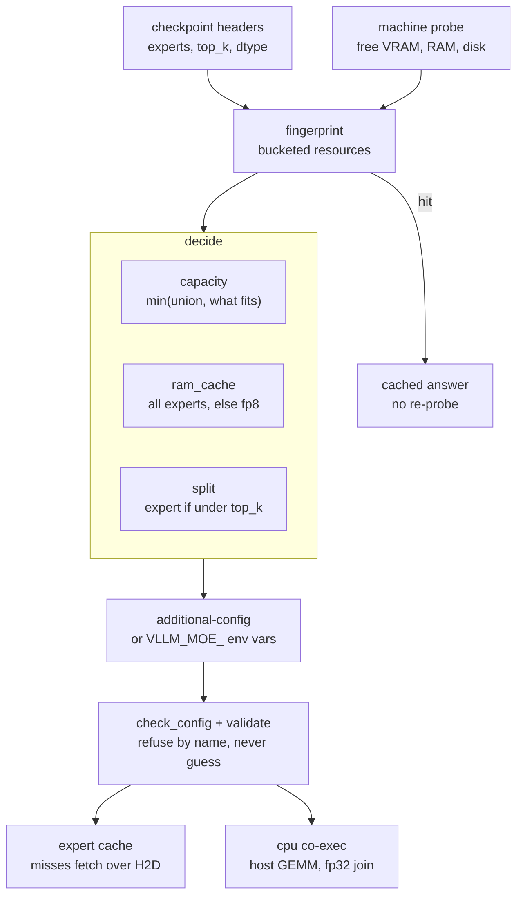
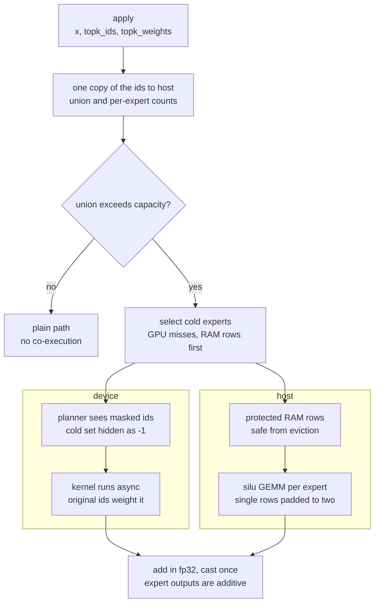
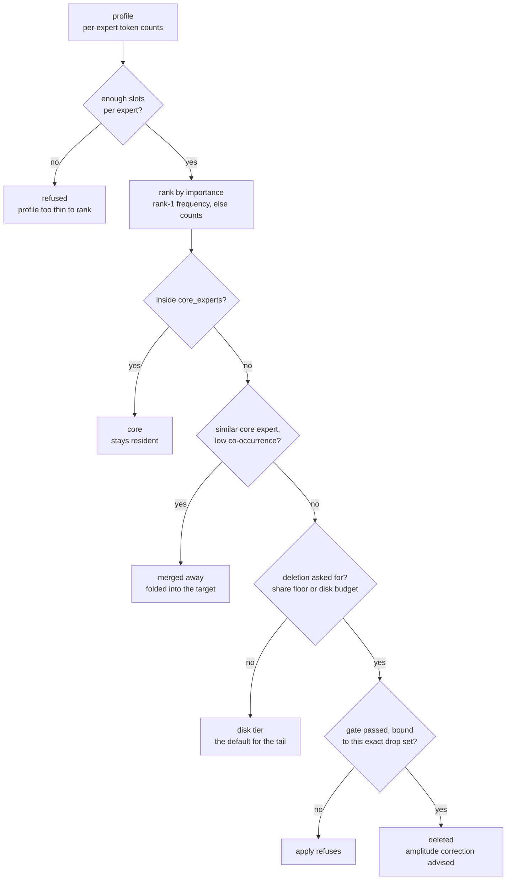

# moe-surgeon

Serve a Mixture-of-Experts model in less memory than it fits in. Cold experts
live on NVMe and stream to a GPU cache on demand; in eager mode a correctly
sized cache is numerically transparent, so the tiered model produces the same
tokens as the untiered one. (`split: "expert"`, `fp8_store` and CUDA graphs are
the measured exceptions — see
[docs/benchmarks.md](docs/benchmarks.md#numerical-transparency).)

It installs as a vLLM plugin. No fork, no patched vLLM. Supported vLLM range
`>=0.26.0,<0.28`, verified by running on a stock 0.27.1 install rather than by
parsing it.

```bash
pip install git+https://github.com/yasinyaman/moe-surgeon.git
surgeon autoconfig --checkpoint /path/to/model --start
```

## What it does

| you have | you get |
|---|---|
| a model too large for the card | it runs — 12.9 GiB model at 2.69 GiB peak |
| slow cold starts | ~17 s instead of ~129 s |
| a card that fits the model already | nothing; don't use this |

The cost is decode throughput: a correctly sized tier runs at 0.66× untiered.
This is a feasibility and load-time mechanism, not a speed one.

Optional, and measured separately: permanent expert pruning for deployments
that only ever see one domain, and CPU co-execution on discrete cards.

## Install

```bash
pip install git+https://github.com/yasinyaman/moe-surgeon.git
```

Requires vLLM at serve time. The offline commands (`budget`, `plan`, `tier`,
`inspect`, `recommend`) run without vLLM, without CUDA and without a GPU.

Registration is automatic through a `vllm.general_plugins` entry point. Verify
it took:

```bash
python -c "from importlib.metadata import entry_points; \
print([e.name for e in entry_points(group='vllm.general_plugins')])"
```

## Quick start

**Let it size itself and serve:**

```bash
surgeon autoconfig --checkpoint /path/to/model --start
```

It probes the machine once, caches the decision, and runs `vllm serve` with the
right settings. `--json` prints the config instead of starting; omit `--start`
to see the reasoning.

**Or talk to it interactively, with per-turn cost:**

```bash
surgeon run allenai/OLMoE-1B-7B-0924 --checkpoint /path/to/model
```

```
>>> explain a b-tree in two sentences
A B-tree is a self-balancing search tree ...
  [128 tok, 142.2 tok/s, cache 93% (15302/16384)]
```

`/stats` summarises the session and names a misconfiguration if the counters
show one. `/help` lists the commands. `--no-tier` serves untiered for a
side-by-side.

**Or configure vLLM yourself:**

```bash
vllm serve allenai/OLMoE-1B-7B-0924 \
  --additional-config '{"surgeon": {"expert_cache_size": 48,
      "store_dir": "./store", "ram_cache": 64}}'
```

The store builds itself on first boot and is reused afterwards.

The checkpoint must be a **local directory** for sizing, because the analysis
reads safetensors headers. Pass a repo id as the model and `--checkpoint` for
the local copy when they differ.

## Commands

| command | what it answers | needs |
|---|---|---|
| `surgeon budget` | will this model fit, and in how little | nothing |
| `surgeon vram-floor` | the smallest budget it actually boots in | GPU |
| `surgeon autoconfig` | how should this machine be configured | nothing |
| `surgeon run` | serve it interactively, with the cost shown | GPU |
| `surgeon headroom` | is a different checkpoint better for my domain | GPU |
| `surgeon recommend` | which methods does this target want | nothing |
| `surgeon profile` | which experts does my workload use | GPU |
| `surgeon inspect` | what routing signals does this checkpoint carry | nothing |
| `surgeon plan` | turn a profile and a budget into a placement | nothing |
| `surgeon gate` | what would this plan's deletions cost | GPU |
| `surgeon apply` | write the pruned checkpoint | nothing |
| `surgeon calibrate` | what amplitude should a pruned checkpoint carry | GPU |
| `surgeon ablate` | what do these experts contribute | GPU |
| `surgeon fidelity` | how far did this configuration move the output distribution | GPU |
| `surgeon tier` | build the store offline | nothing |
| `surgeon serve` | run the pipeline over HTTP | GPU for its stages |
| `surgeon seams` | will this survive a vLLM upgrade | nothing |

Every command takes `--help`.

## Headline numbers

Measured on a DGX Spark (GB10, 121 GB unified) and an RTX 3050 Ti laptop
(3.68 GiB usable). Full tables and method: [docs/benchmarks.md](docs/benchmarks.md).

| | measured |
|---|---|
| serves a 12.9 GiB model on a 3.68 GiB card | 2.69 GiB peak |
| load time, cache 48 | 16.9 s vs 128.9 s untiered |
| **cache size, the one knob that matters** | **2.67× decode across one integer** |
| decode, correctly sized | 145.1 vs 218.5 tok/s untiered |
| numerical transparency, eager | identical token hashes, 9 of 9 runs |
| how far the non-exact settings move the output | split 98.2%, `fp8_store` 97.4% top-1 agreement |
| CPU co-execution, discrete card | 1.58×, and 1.94× with enough host RAM |
| CPU co-execution, unified memory | 0.719× — a loss, refused |

## Configuring it

The spread between a good and a bad configuration of this package is larger than
most of the decisions around it: on one card, one model and one sitting, nineteen
settings span **75 to 277 ms per output token**. Three rules cover most of it.

**Size the GPU cache against the batch's per-layer expert union, not against the
expert count.** Below the union every layer splits into chunks and each chunk
re-reads; above it the split disappears. This is the 2.67× above, and it is one
integer.

**Give the host tier as much as the pinned-pool rule allows.** `ram_cache` is what
turns a disk read into a RAM hit, and it is also what makes CPU co-execution
worth having — measured 1.16× at `ram_cache` 8 against **1.94× at 36**, because
co-execution can only avoid sending bytes that are already in host RAM.

**Set `VLLM_MOE_DISK_BUFFERED` by the pool's absolute size.** Reading the store
through the OS page cache instead of `O_DIRECT` is worth 1.24–1.52× when the
pinned pool is small, and *costs* up to 1.16× when it is large enough that the
cache is just a second copy. The crossover measured near `ram_cache` 24; it is not
"whether the pool covers the store" — at 36 it still does not, and buffered is
still wrong.

`surgeon autoconfig` picks the first two from the machine. The tables, the method
and the noise floor are in [docs/benchmarks.md](docs/benchmarks.md); read the note
there on which column is readable before quoting a concurrency number.

## How it fits together

**Sizing runs before any engine boots.** The checkpoint is read from safetensors
headers alone and the machine is probed once, so `surgeon autoconfig` answers in
seconds without a GPU. Both readings are bucketed before they reach the cache
key — free VRAM moves by a few MiB between two consecutive reads, and an exact
key would never hit.



Those three decisions are the whole of the sizing logic. Anything that would
produce wrong output instead of an error — tensor parallelism, CUDA graphs
without the MoE split, fp8 with `cpu_experts` — is refused by name, with the way
out in the message.

**A forward under co-execution splits one layer between two processors.** The
routing ids play two roles: a masked copy goes to the planner, so it never
fetches what the host will compute, while the original goes to the kernel, so
every surviving pair still gets its gate weight.



The join is legal because an MoE output is a gate-weighted sum over the experts
a token chose, so the sum can be taken a subset at a time. Two things the
diagram cannot show, both measured: the win is **not** the overlap (~124 ms/token
of PCIe becomes ~41 ms/token of host compute, and the measured ~82 ms/token
saving is close to that difference), and while co-execution covers the miss set
**the GPU cache stops adapting** — every host-served expert is hidden from the
planner, so the resident set freezes. The collapse in misses is masking, not
learning.

**Surgery decides where each expert goes, one layer at a time**, and only the
last outcome is irreversible.



**Nothing is deleted unless asked**: with no share floor and no disk budget the
whole tail lands on the tier. **A merge is not a deletion**, so merges are not
gated — zeroing an expert cannot emulate folding it. And **the gate is bound to
the drop set it measured**, by digest. What the gate cannot certify is task
accuracy: its ceiling is a perplexity ratio, and on a broad workload the same
plan that passes it costs arc_challenge −25% relative.

## Three axes

Every method here is judged on **three axes**, never one, and a method that
loses on one axis is not eliminated if it wins on another.

| axis | what it asks | how it is measured |
|---|---|---|
| **feasibility** | does it run, and on how small a device | `surgeon budget`, `surgeon vram-floor`, measured load time |
| **speed** | tokens per second | `compat/bench.py`, short prompts / long generations |
| **accuracy** | held-out perplexity | `compat/ablation.py`, the same metric the gate uses |

Two results exist only because of that rule. Static gate geometry is useless
for *choosing* experts — gate row norm against measured load correlates
ρ = −0.03, gate cosine against measured co-occurrence ρ = +0.00 — and genuinely
useful for *sizing* them, so it ships as `surgeon budget` rather than being
discarded. And
`fp8_store` saves **zero** VRAM while halving disk, host RAM and transfer — a
one-axis win that a speed-only or memory-only verdict would have thrown away.

Read every "accuracy" row as **perplexity**, which is a proxy: the pruned
checkpoint that passed a 1.3× perplexity gate lost 25% relative arc_challenge.

## Documentation

| doc | what it covers |
|---|---|
| [docs/scenarios.md](docs/scenarios.md) | worked examples: small card, big box, narrow domain, multi-model |
| [docs/configuration.md](docs/configuration.md) | every setting, every default, every refusal |
| [docs/benchmarks.md](docs/benchmarks.md) | measured numbers and how they were taken |

## Limits

Refused by name rather than mishandled: tensor parallelism, block-quantised
fp8, MoE layers with bias terms, and running alongside vLLM's in-tree expert
cache. `cpu_experts` additionally refuses fp8 stores and checkpoints,
zero-copy, CUDA graphs, non-silu activations and router-weight-on-input models.

Expert pruning costs downstream task accuracy that a perplexity gate does not
catch, so `apply` refuses to delete without a measured, plan-bound verdict.

## Licence

Apache-2.0.
