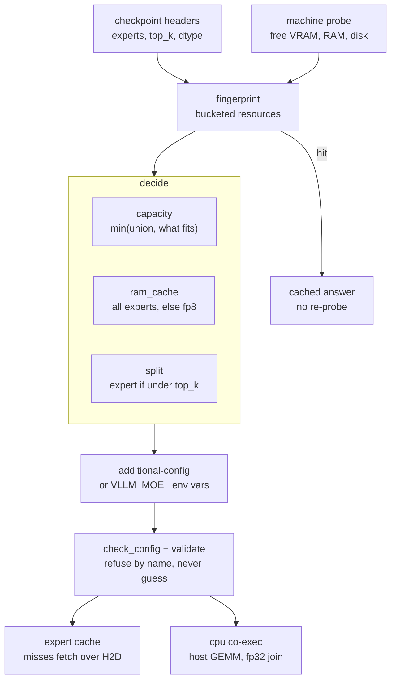
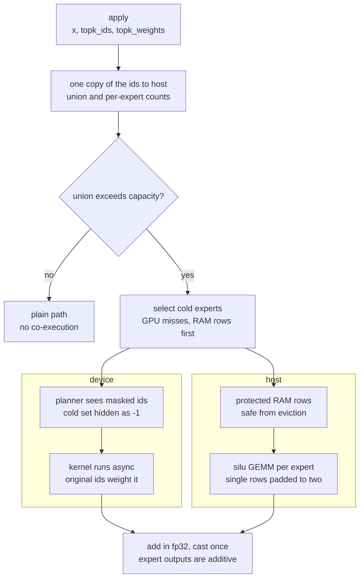
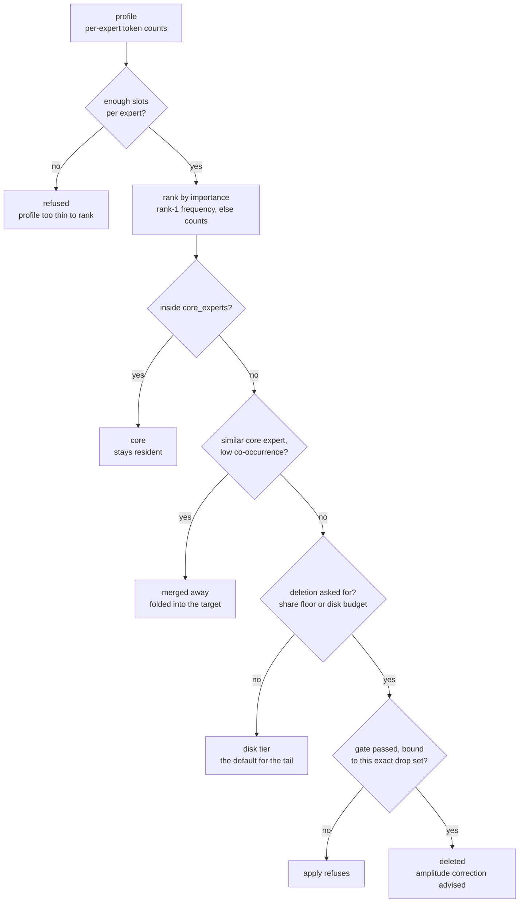

# moe-surgeon

Fit a domain-specialised MoE deployment into less memory: an NVMe expert tier,
with permanent offline pruning and merging where a model supports it.

A general MoE model carries experts for every domain it was trained on. A
deployment that only ever sees one domain pays for all of them. This package
measures which experts that deployment actually uses, then makes it cheaper to
serve — primarily by tiering cold experts to NVMe, and, where the measurements
justify it, by dropping the genuinely unused ones and merging redundant ones into
a smaller checkpoint.

**On the models measured here (OLMoE, Qwen3-30B) the disk tier is the primary
mechanism, not pruning** — on broad workloads they have no dead tail and no
mergeable pairs, so deletion costs quality (measured below) and exists to
*support* the tier: a smaller candidate set and store. On a genuinely narrow
domain the calculus shifts — [measured below](#when-pruning-does-pay-a-narrow-domain-measured)
on real system logs — but the order never changes: tier first, prune only when
the measurements say so. Redundancy is a per-model property, so the
pruning and merging machinery is kept and tested; it is simply not the win on
these two families. See [DECISIONS.md](DECISIONS.md).

## Why use it

Because it changes what a machine can serve, and it proves what it costs. All
numbers below are measured, on hardware, and reproduced in this README:

- **A 12.9 GiB model on a 4 GiB laptop GPU.** The tier serves OLMoE-1B-7B at
  **2.69 GiB peak** (7.7 tok/s) on an RTX 3050 Ti that cannot even load the model
  untiered — the machine swaps itself unreachable trying. This is the regime the
  package exists for: the checkpoint no longer has to fit.
- **~8× faster load.** Expert weights stream into the store instead of being staged
  onto the device: 13–15 s against 118 s untiered on the same box. If your workflow
  boots models often, this alone may be the reason.
- **Bit-exact.** A correctly configured tier reproduces the untiered token stream
  exactly — verified by hashing seed-pinned greedy runs, nine for nine, including
  the zero-copy path — and runs under vLLM's default CUDA-graph serving mode.
- **The cost is stated, not hidden: decode.** At the measured-correct size the tier
  decodes at 0.66× untiered (143 vs 218 tok/s on GB10). It is a feasibility and
  load-time mechanism, not a throughput one. If the model already fits comfortably
  and load time does not matter, you do not need this package.
- **No fork.** A `pip install` and a `vllm.general_plugins` entry point on stock
  vLLM. Every internal it borrows is declared in [seams](src/vllm_moe_surgeon/compat/seams.py)
  and checked by CI weekly against vLLM's latest release — at last check, one full
  minor version past the pin, zero required seams broken.
- **It sizes itself.** The two misconfigurations worth 2.6× and 1.7× were found by
  measurement; `surgeon autoconfig` applies those rules to your machine so you do
  not rediscover them the slow way.

## The numbers, in one table

Every row measured on hardware, one arm per process, decode timed on a
short-prompt/long-generation workload after a warm-up. Method, machines and
the full set: [docs/benchmarks.md](docs/benchmarks.md).

| what | machine | measured | reading |
|---|---|---|---|
| **serves a 12.9 GiB model on a 3.7 GiB card** | laptop | 2.69 GiB peak, 7.7 tok/s | untiered never boots — the host swaps itself unreachable |
| **load time** | GB10 | 13–15 s vs 118 s untiered | ~8×, from streaming into the store |
| **boot floor** | GB10 | 11.55 vs 14.29 GiB untiered | 19% below untiered (streamed fp8) |
| **capacity, the one knob** | GB10 | 54.3 → 145.1 tok/s (cap 24 → 48) | **2.67×** across one integer, perplexity identical |
| decode, correctly sized | GB10 | 145.1 vs 218.5 untiered | 0.66× — the cost, stated |
| **CPU co-execution** | laptop | 4.66 → 7.37 tok/s | **1.58×**, opt-in, discrete cards only |
| CPU co-execution | GB10 | 0.719× | a **loss** on unified memory — refused by record |
| tier transparency | GB10 | identical token hashes, 9/9 | untiered ≡ tiered ≡ zero-copy |
| pruning, broad domain | GB10 | 1.25× perplexity, arc −25% | why deletion is a last resort |
| pruning, narrow domain | GB10 | 1.17× ppl, +25% decode, −4.5 GiB | where deletion does pay |

The two rows that disagree with each other are the point: the same CPU
co-execution code wins 1.58× on a discrete card and loses on unified memory,
because the whole mechanism depends on whether host DRAM and device transfers
are separate bandwidth pools. Measured `BW_cpu_gemm/BW_h2d` is 3.09 on the
laptop and 0.78 on GB10 — that ratio is the predictor, and it is why this one
ships as a per-machine opt-in rather than a default.

## Quick start

Not on PyPI yet — install from the repository:

```bash
pip install git+https://github.com/yasinyaman/moe-surgeon.git
```

Then either talk to a model interactively, with the tier's cost printed per turn:

```bash
surgeon run allenai/OLMoE-1B-7B-0924 --checkpoint /path/to/checkpoint
```

or size the tier for this machine and serve:

```bash
surgeon autoconfig --checkpoint /path/to/checkpoint --start
```

Both probe the machine once, cache the decision, and boot vLLM with an
`--additional-config '{"surgeon": {...}}'` — the tier is a plugin, so it is `vllm
serve` underneath and every other vLLM flag works as usual. The store builds itself
on the first boot (streamed, so the full expert tensors never materialise) and is
reused afterwards.

The checkpoint must be a **local directory** for sizing (the analysis reads
safetensors headers); pass a repo id as the model and `--checkpoint` for the local
copy if they differ.

### The commands

| stage | command | needs |
|---|---|---|
| serve, interactively | `surgeon run` | GPU |
| size + serve | `surgeon autoconfig [--start]` | nothing |
| "will it fit at all" | `surgeon budget` / `surgeon vram-floor` | nothing / GPU |
| what does this deployment use | `surgeon profile` | GPU |
| inspect routing signals | `surgeon inspect` | nothing |
| choose a strategy | `surgeon recommend` | nothing |
| prune (last resort) | `surgeon plan` → `gate` → `apply` | GPU for gate |
| build the store offline | `surgeon tier` | nothing |
| measure expert contribution | `surgeon ablate` / `surgeon calibrate` | GPU |
| before a vLLM upgrade | `surgeon seams` | nothing |
| pipeline over HTTP | `surgeon serve` | GPU for the stages it runs |

Pruning is deliberately not in the quick start: on the families measured here it
costs downstream-task accuracy the perplexity gate cannot see (arc_challenge −25%
relative), so `apply` refuses to delete without a measured, plan-bound gate verdict.
The tier keeps every expert and costs none.

## Sizing it

Three measured rules decide nearly everything; `surgeon autoconfig` applies them
to your machine and caches the answer:

| setting | rule | measured |
|---|---|---|
| `expert_cache_size` | cover the serving batch's per-layer expert union, not free VRAM | 24 → 48 slots: **2.59×** decode |
| `ram_cache` | ≥ the expert count, or every eviction reads disk | 48 → 64: **1.66×** |
| `fp8_store` | space mechanism only — on when the store/RAM does not otherwise fit | 1.11× slower, not bit-exact |

The slots are paid for out of KV cache, not free device memory — capacity buys
throughput and spends context. The full evidence, including the boot-floor
instrument and the capacity sweep, is in [docs/sizing.md](docs/sizing.md).

## How it fits together

**Sizing runs before any engine boots.** The checkpoint is read from safetensors
headers alone and the machine is probed once, so `surgeon autoconfig` answers in
seconds without a GPU. Both readings are bucketed before they reach the cache
key — free VRAM moves by a few MiB between two consecutive reads, and an exact
key would never hit.



Those three decisions are the whole of the sizing logic, and the table above is
where each one's number comes from. Anything that would produce wrong output
instead of an error — tensor parallelism, CUDA graphs without the MoE split,
fp8 with `cpu_experts` — is refused by name, with the way out in the message.

**A forward under co-execution splits one layer between two processors.** The
trick is that the routing ids play two roles: a masked copy goes to the planner,
so it never fetches what the host will compute, while the original goes to the
kernel, so every surviving pair still gets its gate weight. Experts hidden by
the expert map contribute zero, so nothing is counted twice.



The join is legal because an MoE output is a gate-weighted sum over the experts
a token chose, so the sum can be taken a subset at a time — the same property
the expert split already relies on. "Protected" is not decoration: a row being
read by a host GEMM would otherwise be evictable mid-multiply, so those rows are
skipped by both eviction scans between claim and release.

Two things the diagram cannot show, both measured. The win is **not** the
overlap: roughly 124 ms/token of PCIe transfer is replaced by ~41 ms/token of
host compute, and the measured saving (~82 ms/token) is close to that
difference — computing an expert is simply cheaper than moving it, on the right
machine. And while co-execution covers the whole miss set, **the GPU cache stops
adapting**: every host-served expert is hidden from the planner, so the cache
only meets experts it already holds and its resident set freezes. The collapse
in misses is masking, not learning.

**Surgery decides where each expert goes, one layer at a time.** Experts are
ranked by importance — rank-1 frequency where the capture supports it, token
counts where it does not — and the ranking decides four outcomes, of which only
the last is irreversible.



Three things in that flow are deliberate. **Nothing is deleted unless asked**:
with no share floor and no disk budget the whole tail lands on the tier, which
is why `surgeon plan` on a cold tail reports "deletes nothing" until
`--disk-experts 0` says otherwise. **A merge is not a deletion** — the donor's
weights fold into a survivor, so merges are not gated, because zeroing an
expert cannot emulate folding it. And **the gate is bound to the drop set it
measured**, by digest: gating a small deletion and then editing more experts
into the plan is caught at apply rather than silently authorised.

Deletion is the one irreversible step in the pipeline and its cost is
measurable before it is paid, so paying it unmeasured has to be an explicit
choice. What the gate cannot certify is task accuracy — the ceiling is a
perplexity ratio, and on a broad workload the same plan that passes it costs
arc_challenge −25% relative.

## When pruning does pay: a narrow domain, measured

Pruning costs quality on broad workloads (arc_challenge −25% relative on a
general benchmark — the reason `apply` refuses to delete without a measured gate
verdict). The recurring question is whether a deployment that only ever sees one
kind of input — a log-analysis system, say — escapes that. Measured end to end
on real system logs (Linux+SSH+Apache triage prompts, held-out lines for the
gate, other log families as the distribution probe):

**The narrow domain concentrates routing.** For the first time a near-dead tail
exists (median 7 of 64 experts per layer under 10% of uniform; a broad domain
had none), and `surgeon profile` now prints exactly this diagnosis.

**The cost, and the trap** (held-out log perplexity, baseline 27.89):

| pruned to | applied | ratio |
|---|---|---|
| 56 of 64 (the dead tail) | 30.64 | 1.10× |
| 40 of 64, **without amplitude** | 41.00 | **1.47× — the trap** |
| 40 of 64, **with amplitude 0.85** | 32.53 | **1.17×** |

Deletion inflates the surviving gates by 1/(1−P_D); on a narrow domain that
inflation bites harder than the gate's zeroing emulation, so the amplitude
correction is **mandatory** here. The plan predicts it analytically from its own
deleted routing mass — the predicted 0.861 measured within 0.2% of the
engine-calibrated 0.850 — and `apply` warns if it is skipped. The prediction is
1 − (mean deleted share over **all** layers), because the scalar folds into
every layer's survivors; when deletion concentrates in a few layers the global
scalar fits poorly and `surgeon calibrate` is the honest answer.

**The gain, tier against tier at full coverage:**

| configuration | GPU slot bytes | decode |
|---|---|---|
| **pruned-40 + tier, 40/40 resident** | **7.5 GiB** | **256.2 tok/s** |
| unpruned + tier, 64/64 resident | 12.0 GiB | 205.1 tok/s |
| unpruned, untiered | 12.0 GiB | 218.2 tok/s |

Pruning buys **compute**, not just memory — a 40-expert kernel is smaller than a
64-expert one, so the pruned model beats even the untiered baseline — and the
4.5 GiB of released slots go straight into the KV cache at a fixed memory
budget. So on a narrow domain the pruned+tier composition wins throughput,
memory and footprint at once, for a measured 1.17× in-domain perplexity cost.
The general-task damage does not go away — this is for deployments that never
leave their domain. Full experiment in
[DECISIONS.md](DECISIONS.md#narrow-domain-pruning-measured-on-real-logs-2026-08-12).

## Documentation

| doc | what it covers |
|---|---|
| [docs/benchmarks.md](docs/benchmarks.md) | every measured number in one place, with the machine and the method |
| [docs/serving.md](docs/serving.md) | the out-of-tree runtime, fp8, the interactive prompt, cold start |
| [docs/sizing.md](docs/sizing.md) | the measured sizing rules, autoconfig, boot floors, streaming load, CUDA graphs, the capacity sweep |
| [docs/surgery.md](docs/surgery.md) | profiling, planning, pruning/merging, the amplitude fix, the quality gate |
| [docs/architecture.md](docs/architecture.md) | the layering rule, the seam table, what a vLLM upgrade costs |
| [docs/server.md](docs/server.md) | the HTTP job pipeline |
| [DECISIONS.md](DECISIONS.md) | the decision register: per-axis verdicts and every benchmark behind them |

## Status

Published, CI-checked, and verified on two machines. The out-of-tree runtime is
token-identical to the in-tree implementation it replaces and to untiered vLLM;
the full `profile → plan → gate → tier` pipeline has run end-to-end through the
job server from nothing but a repository id; and all three axes are measured —
including the tier's own costs, stated above rather than discovered later.

- Serving: unquantized and fp8 checkpoints; piecewise CUDA graphs (no
  `--enforce-eager`); streaming load on by default; bit-exactness verified by
  token-stream hash across untiered, tiered and zero-copy runs.
- CPU expert co-execution (`cpu_experts`, opt-in): on a discrete card, cold
  experts are computed on the host instead of fetched over PCIe — measured
  **1.29–1.58× live** on the small-VRAM laptop (7.37 tok/s, its best serve of
  this model), and refused-by-record on unified-memory hosts where the same
  experiment measured a loss. Not bit-exact, and loud about it. Numbers and
  method: [docs/benchmarks.md](docs/benchmarks.md).
- Sizing: measured rules (`expert_cache_size` toward the batch's per-layer union,
  `ram_cache` ≥ the expert count, `fp8_store` only under space pressure), applied
  automatically by `surgeon autoconfig` and cached per machine.
- Measured on: OLMoE-1B-7B and Qwen3-30B-A3B end to end; DeepSeek-V2-Lite and
  Granite-3.0 read and screened. Two expert-storage layouts read and written.
- Upstream: every borrowed vLLM internal is a declared seam; CI checks the pin on
  every push and vLLM's latest release weekly, opening an issue that names the
  symbol when one moves. At last check: v0.27.1, zero required seams broken.
- Known limits, refused loudly rather than mishandled: tensor parallelism (store
  identity has no rank component), block-quantised fp8, MoE layers with bias
  terms, in-tree and out-of-tree cache both enabled; and for `cpu_experts`:
  fp8 stores and checkpoints (no CPU dequant twin), zero-copy, CUDA graphs,
  non-silu activations, router-weight-on-input models.

[DECISIONS.md](DECISIONS.md) is the decision register: per-method verdicts on the
three axes, the benchmarks behind every number quoted here, and the open items
with reasons.
